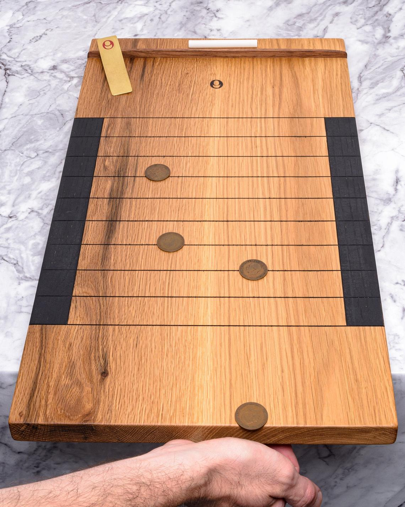

# Shove Ha'Penny

## Site

- [local](http://localhost:8000/)
- [Published](https://alexhedley.github.io/REPONAME)

## Run

`py -m http.server`

## Game

- [Etsy](https://www.etsy.com/uk/listing/1030091210/shove-hapenny-number-twelve-featuring-5)
- [Masters Deluxe Shove Ha'penny Board in Oak](https://www.mastersofgames.com/cat/pub/masters-premium-hand-made-shove-hapenny-board.htm)

> A truly deluxe Shove Ha'penny board, lovingly handmade in oak by London based artisan, Oakes & Oakes. This solid oak wood board is beautifully finished and features grooved lines, side scoring lanes painted with chalkboard paint, a walnut coin stop at the top of the board and a front baton on the underside to hold it in place on a table. We believe this to be the finest Shove Ha'penny board available.

> Handmade using only hand tools, each board is unique and numbered. The playing surface has been hand-sanded to a super-fine grade, and then oiled with natural oil for optimum performance.

> Shove Ha'penny is a true British pub game classic that dates back to the middle ages. It's both challenging and entertaining, with skilful yet simple gameplay. It is therefore suitable for children and adults and is enjoyed both casually at home or in pubs and more seriously in tournaments, leagues and competitions. To comply with competition play, this board features grooved lines to mark out the scoring beds allowing disputes to be easily resolved; run a straight edge (e.g. bank card) along the line and if the coin moves, it's not completely in the bed and doesn't score.

> The Masters Deluxe Shove Ha'penny Set is completed with 5 authentic halfpenny coins, a stick of chalk for scoring and a rules sheet.

> A classic British pub game elevated; a traditional game to treasure.

> Approx. Dimensions:

> 54 x 30 x 4cm
> 21.3x11.8x1.6 inch

> Contains small parts. Unsuitable for children under 36 months.
